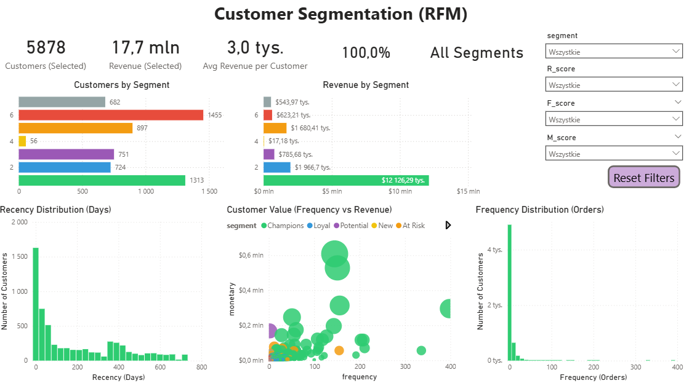

# 📊 Customer Segmentation (RFM Analysis)

## 📌 Project Overview

This project focuses on customer segmentation using the RFM (Recency, Frequency, Monetary) model.
The goal was to identify high-value customers and analyze purchasing behavior using SQL and Power BI.

---

## 🎯 Business Problem

Not all customers contribute equally to revenue.
The objective was to segment customers and identify:

* high-value customers
* inactive (lost) customers
* customers with growth potential

---

## 🛠 Tools & Technologies

* SQL Server – data cleaning and transformation
* Power BI – dashboard and data visualization

---

## 📂 Dataset

The analysis is based on an e-commerce dataset including:

* transactions
* customers
* products

---

## 🔎 Analysis Steps

### 1. Data Preparation (SQL)

* combined datasets from multiple periods
* removed invalid data:

  * cancelled orders
  * missing customer IDs
  * negative values
* created `order_value` (Quantity × Price)

---

### 2. Aggregation

* aggregated data at customer level
* calculated RFM metrics:

  * Recency
  * Frequency
  * Monetary

---

### 3. RFM Scoring

* applied `NTILE(5)` to create:

  * R_score
  * F_score
  * M_score

---

### 4. Segmentation

Customers were grouped into:

* Champions
* Loyal
* Potential
* New
* At Risk
* Lost
* Others

---

### 5. Visualization (Power BI)

Built an interactive dashboard including:

* KPI metrics:

  * Total Customers
  * Total Revenue
  * Avg Revenue per Customer

* Visualizations:

  * Customers by Segment
  * Revenue by Segment
  * Recency Distribution
  * Frequency Distribution
  * Scatter plot (Frequency vs Revenue)

* Interactivity:

  * segment filters
  * RFM filters
  * reset button

---

## 📈 Key Insights

* Most customers make only one purchase
* A small group of customers generates the majority of revenue
* High-value customers are clearly visible in the top-right area of the scatter plot
* A large portion of customers is inactive (lost)

---

## 📊 Dashboard

Interactive Power BI dashboard presenting customer segmentation (RFM) and purchasing behavior.  

---

## 🚀 Conclusions

Customer value is highly concentrated in a small segment of users, indicating strong customer inequality.  

👉 The main opportunity lies in:

* retaining high-value customers
* reactivating lost customers
* developing potential customers

---

## 💡 Author Note

This project demonstrates:

* SQL data transformation
* business-oriented analysis
* customer segmentation techniques
* dashboard creation in Power BI

---

## 📁 Project Files

* Customer_Segmentation_RFM.pbix – Power BI dashboard  
* rfm_analysis.sql – SQL script for RFM segmentation  
* dashboard.png – dashboard preview

---

# 🇵🇱 Segmentacja klientów (RFM)

## 📌 Opis projektu

Projekt dotyczy segmentacji klientów przy użyciu modelu RFM (Recency, Frequency, Monetary).
Celem było zidentyfikowanie najbardziej wartościowych klientów oraz analiza ich zachowań zakupowych.

---

## 🎯 Problem biznesowy

Nie wszyscy klienci generują taką samą wartość.
Celem analizy było określenie:

* którzy klienci są najbardziej wartościowi
* którzy klienci są nieaktywni
* którzy mają potencjał wzrostu

---

## 🛠 Narzędzia

* SQL Server – przygotowanie danych
* Power BI – dashboard i wizualizacja

---

## 📂 Dane

Analiza oparta jest na danych e-commerce zawierających:

* transakcje
* klientów
* produkty

---

## 🔎 Etapy analizy

### 1. Przygotowanie danych (SQL)

* połączenie danych z różnych okresów
* usunięcie błędnych danych:

  * anulowane zamówienia
  * brakujące ID klientów
  * wartości ujemne
* utworzenie metryki `order_value`

---

### 2. Agregacja

* agregacja danych na poziomie klienta
* wyliczenie metryk:

  * Recency
  * Frequency
  * Monetary

---

### 3. Scoring RFM

* zastosowanie `NTILE(5)`
* utworzenie:

  * R_score
  * F_score
  * M_score

---

### 4. Segmentacja

Podział klientów na segmenty:

* Champions
* Loyal
* Potential
* New
* At Risk
* Lost
* Others

---

### 5. Wizualizacja (Power BI)

Dashboard zawiera:

* KPI:

  * liczba klientów
  * przychód
  * średni przychód na klienta

* Wykresy:

  * liczba klientów wg segmentów
  * przychód wg segmentów
  * rozkład recency
  * rozkład frequency
  * wykres rozrzutu

* Interaktywność:

  * filtrowanie segmentów
  * filtrowanie RFM
  * przycisk reset

---

## 📈 Kluczowe wnioski

* Większość klientów dokonuje tylko jednego zakupu
* Niewielka grupa generuje większość przychodu
* Najbardziej wartościowi klienci są w prawym górnym rogu wykresu
* Duża część klientów jest nieaktywna

---

## 📊 Dashboard

Interaktywny dashboard Power BI prezentujący segmentację klientów (RFM) oraz ich zachowania zakupowe. 

---

## 🚀 Wnioski biznesowe

Wartość klientów jest silnie skoncentrowana w niewielkiej grupie, co oznacza, że tylko część klientów generuje większość przychodów.

👉 Największe możliwości:

* utrzymanie najlepszych klientów
* reaktywacja utraconych
* rozwój klientów z potencjałem

---

## 📁 Pliki projektu

* Customer_Segmentation_RFM.pbix – dashboard Power BI  
* rfm_analysis.sql – skrypt SQL do segmentacji RFM  
* dashboard.png – podgląd dashboardu  

---
